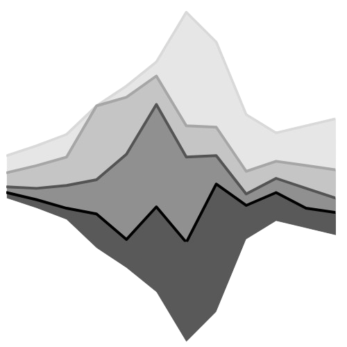

  

<h1 align="center">Strict Compact Tab</h1>

  
  
  
  

  A lightweight, privacy-focused, zero-dependency new tab page designed to run entirely locally. It replaces the default start page with a clean, fast interface featuring a search bar, customizable shortcuts, a clock, and local configuration storage.

---

## Key Features

* **Hidden Dual-Column Settings**: A settings panel is accessible via a gear icon in the bottom-left corner, which remains completely invisible and reveals itself only when hovered over.
* **Shortcut Management & Custom Icons**: Full control over your start page tiles, allowing you to add new shortcuts, edit titles and URLs inline, or delete them. Features a built-in upload button to assign custom PNG icons to your shortcuts, saving them directly as Base64 strings in local storage for zero-latency loading.
* **Shortcut Tabs and Categories**: Organize your favorite sites into custom categories (e.g., Work, Dev, Entertainment). If only one category exists, the interface remains clean and classic. If two or more exist, an elegant horizontal category bar appears above the shortcut grid.
* **Mouse Wheel Scroll Navigation**: Cycle through your shortcut categories globally on the main screen by simply scrolling the mouse wheel up or down.
* **Smooth Transitions**: Switching between shortcut categories is accompanied by a soft, fast, and visually appealing fade-out/fade-in animation.
* **Drag & Drop Sorting**: Reorder your shortcuts or category tabs using native drag-and-drop mechanics. The shortcut list includes automatic container scrolling when dragging near boundaries.
* **Grid Optimization**: Adjust the size of shortcut tiles (85px, 98px, or 110px) and limit the maximum number of items in a single row (from 6 to 12).
* **Color Themes**: Support for Dark, Light, and Adaptive color schemes. The Adaptive theme dynamically extracts a beautiful, harmonious palette in real-time from your uploaded custom background image using Google's material-color-utilities. Enhancements like high-contrast text shadows (glow outlining for light theme) ensure elements remain fully readable on any wallpaper.
* **iOS Widget Mode & Interactive Resizing**: Toggle an alternative, premium iOS-inspired home screen layout that turns elements (Clock, Weather, Search, and Shortcuts Grid) into rounded tiles. During *Edit Layout* mode, widgets display dynamic diagonal handles enabling seamless drag-and-resize with grid snapping. Widgets automatically adapt their content layout (e.g. search bar rearranging horizontally or shortcuts grid wrapping columns) depending on their width-to-height ratio.
* **Local Assets Customization**: Upload a custom background wallpaper and change the page's tab favicon directly from the settings. Selected files are converted to Base64 and kept in your browser's local storage with no external HTTP requests.
* **Canvas Image Compression**: Automated client-side image resizing and compression using the HTML5 Canvas API. Wallpapers, favicons, and custom shortcut icons are optimized before being stored as Base64 to save local storage space and keep JSON backups under 500KB.
* **Responsive Settings Layout**: The settings panel is fully responsive. On narrow screens or smaller viewports, the dual-column layout dynamically rearranges into a single vertical layout to prevent element clipping and ensure readability.
* **Adjustable Clock and Date**: Master toggle to display or hide the clock/date widget on the page (hiding it also hides sub-settings to clean up settings panel). Toggle the display of the current day of the week, choose between 12-hour (AM/PM) and 24-hour formats, and toggle the seconds counter.
* **Confidential Weather Widget**: A private weather display located in the top-right corner of the page. It requires manual city input to prevent geo-tracking or IP leakage (note that when enabled, the browser sends queries directly to the keyless Open-Meteo API to retrieve weather updates; if the toggle is disabled, no network queries are ever initiated). Features automatic duplicate city resolution feedback (showing region and country details).
* **Complete Privacy**: All configurations, shortcut lists, custom wallpapers, and favicons are stored strictly on your local machine using the storage API. The adaptive theme algorithm works 100% offline using a locally bundled version of Google's color utilities. No telemetry, tracking, or external server connections are used (except for the optional weather widget).
* **JSON Backup and Restore**: Export your entire setup (including categories and shortcuts) to a single JSON configuration file or import previous backups with safe fallback values and page reload handling.

---

## Privacy & Security

This extension is built on **offline-first** principles:
* **Local Wallpaper Analysis**: Adaptive theme colors are calculated in your browser using the HTML5 Canvas API and `@material/material-color-utilities`. Your wallpapers are never uploaded to any server.
* **Strict Content Security Policy (CSP)**: The extension uses a strict CSP that blocks all external network requests. The only allowed exceptions are the Open-Meteo APIs (which are only queried if the weather widget is manually enabled).
* **Zero Telemetry**: No usage stats, search history, or personal data are collected, stored, or transmitted.

---

## Installation

### Firefox

1. Open Firefox and navigate to `about:debugging`.
2. Click on **This Firefox** (or **This Browser** in older versions).
3. Click **Load Temporary Add-on...**.
4. Select the `manifest.json` file from your local repository directory.

> **Important Note:** Temporary extensions loaded in Firefox are automatically unloaded when the browser restarts. To preserve your extension across browser sessions, you will need to package the folder into a signed archive or install it on developer-focused distributions of Firefox that allow persistent unsigned installations.

### Chromium

1. Open your browser and navigate to `chrome://extensions/` (or the equivalent extensions page in your browser).
2. Enable **Developer mode** using the toggle switch in the top-right corner.
3. Click **Load unpacked** in the top-left corner.
4. Select the root folder containing the extension files (where `manifest.json` is located).

---

## Getting Started

When loaded for the first time, the extension starts as a blank slate—a black screen with a search bar and clock, containing no pre-configured shortcuts. This ensures no uninvited telemetry or third-party links exist.

To configure your interface:
1. Hover your cursor over the bottom-left corner of the window.
2. Click the gear icon that fades into view.
3. Use the left column of the settings panel to add shortcuts, configure the grid layout, upload your wallpaper, change the tab icon, or manage your custom shortcut categories.
4. Alternatively, use the **Backup** section to import an existing JSON configuration file to restore your settings.

---

## License

This project is licensed under the [MIT License](https://mit-license.org/).
