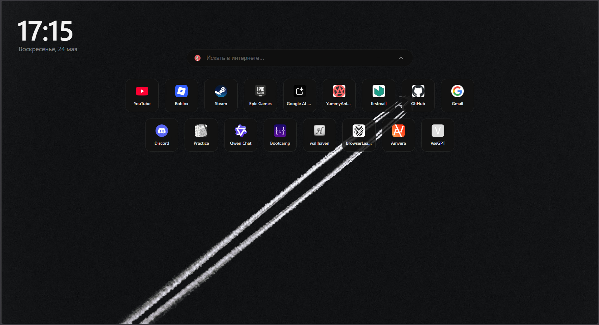
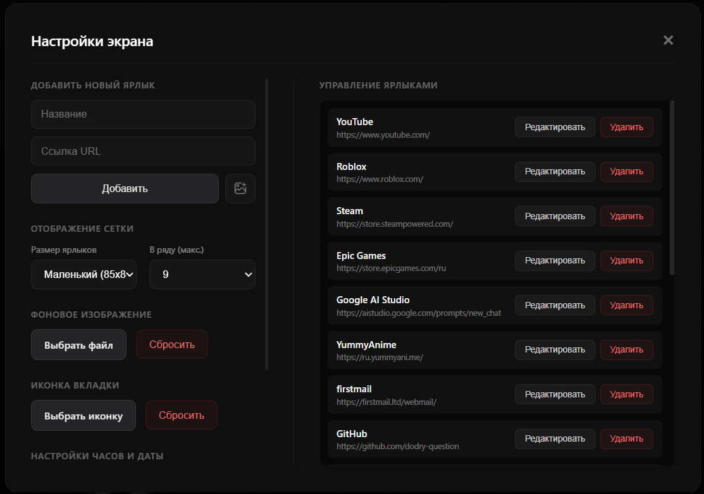

# Strict Compact Tab

A lightweight, privacy-focused, zero-dependency new tab page designed to run entirely locally. It replaces the default start page with a clean, fast interface featuring a search bar, customizable shortcuts, a clock, and local configuration storage.

  

  
Show Settings Panel Preview

   
  

    
  

---

## Key Features

* **Hidden Dual-Column Settings**: A settings panel is accessible via a gear icon in the bottom-left corner, which remains completely invisible and reveals itself only when hovered over.
* **Shortcut Management**: Full control over your start page tiles, allowing you to add new shortcuts, edit titles and URLs inline, or delete them.
* **Drag & Drop Sorting**: Reorder your shortcut list with native drag-and-drop mechanics, including automatic scrolling when an item is dragged near the top or bottom boundary of the list.
* **Grid Optimization**: Adjust the size of shortcut tiles (85px, 98px, or 110px) and limit the maximum number of items in a single row (from 6 to 12).
* **Local Assets Customization**: Upload a custom background wallpaper and change the page's tab favicon directly from the settings. Selected files are converted to Base64 and kept in your browser's local storage with no external HTTP requests.
* **Adjustable Clock and Date**: Toggle the display of the current day of the week, choose between 12-hour (AM/PM) and 24-hour formats, and toggle the seconds counter.
* **Complete Privacy**: All configurations, shortcut lists, custom wallpapers, and favicons are stored strictly on your local machine using the storage API. No telemetry, tracking, or external server connections are used.
* **JSON Backup and Restore**: Export your entire setup to a single JSON configuration file or import previous backups with safe fallback values and page reload handling.

---

## Installation

### Firefox

1. Open Firefox and navigate to `about:debugging`.
2. Click on **This Firefox** (or **This Browser** in older versions).
3. Click **Load Temporary Add-on...**.
4. Select the `manifest.json` file from your local repository directory.

> **Important Note:** Temporary extensions loaded in Firefox are automatically unloaded when the browser restarts. To preserve your extension across browser sessions, you will need to package the folder into a signed archive or install it on developer-focused distributions of Firefox that allow persistent unsigned installations.

### Chromium

1. Open your browser and navigate to `chrome://extensions/` (or the equivalent extensions page in your browser).
2. Enable **Developer mode** using the toggle switch in the top-right corner.
3. Click **Load unpacked** in the top-left corner.
4. Select the root folder containing the extension files (where `manifest.json` is located).

---

## Getting Started

When loaded for the first time, the extension starts as a blank slate—a black screen with a search bar and clock, containing no pre-configured shortcuts. This ensures no uninvited telemetry or third-party links exist.

To configure your interface:
1. Hover your cursor over the bottom-left corner of the window.
2. Click the gear icon that fades into view.
3. Use the left column of the settings panel to add shortcuts, configure the grid layout, upload your wallpaper, or change the tab icon.
4. Alternatively, use the **Backup** section to import an existing JSON configuration file to restore your settings.

---

## License

This project is licensed under the [MIT License](https://mit-license.org/).