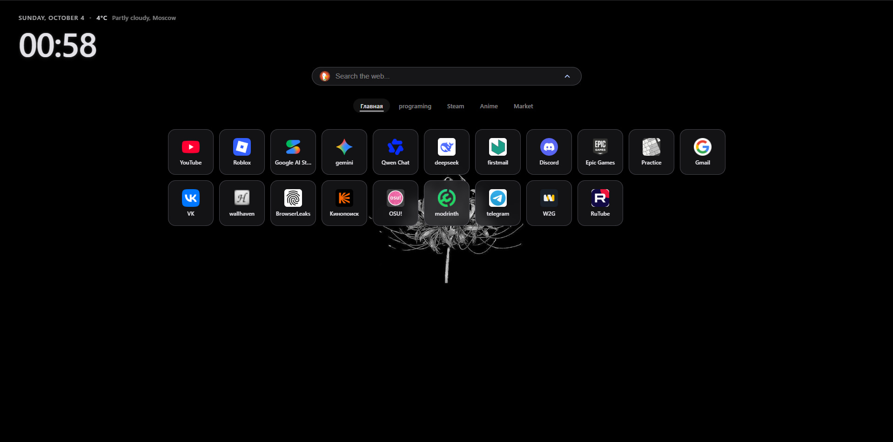
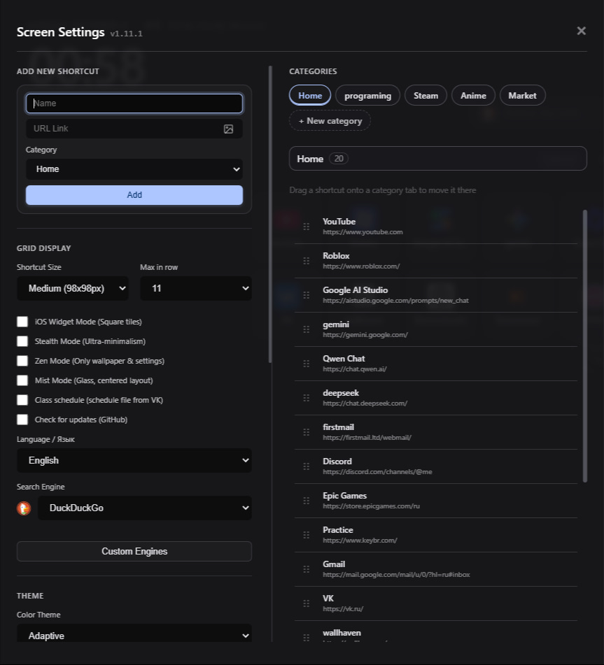

  

<h1 align="center">Strict Compact Tab</h1>

  
  
  
  

  A lightweight, privacy-focused, zero-dependency new tab page designed to run entirely locally. Originally created as a personal project with the help of AI assistance, it replaces the default start page with a clean, fast interface featuring a search bar, customizable shortcuts, a clock, and local configuration storage.

---

## Key Features

* **Left-Aligned Settings Sidebar Dashboard**: A premium, dual-column settings sidebar dashboard accessible via a gear icon in the bottom-left corner (which fades in when hovered over). It slides in gracefully from the left edge of the viewport using hardware-accelerated GPU transitions, keeping configurations clean and organized.
* **Stealth Mode (Ultra-Minimalism)**: Toggle an ultra-minimalist mode that strips backgrounds, outlines, and shadows off your shortcut tiles. Active widgets (Clock, Weather, and the Search Bar) fade to a low-profile 70% opacity in idle state, and shortcut icons drop to an 85% monochrome grayscale. All elements smoothly transition back to full color and 100% opacity upon hovering over them.
* **Mist Mode (Glass Minimalism)**: A one-click preset inspired by "Mist — Minimal New Tab". It recomposes the page into a calm, centered column: a thin `font-weight: 200` clock and date at the top, a translucent search capsule (`backdrop-filter: blur(16px)`, `rgba(255,255,255,0.1)` borders), and a single row of pill-style shortcuts (18px monochrome icons with text inside 12px-rounded, semi-transparent capsules). Shortcut groups are rendered as the same minimal horizontal category tab bar used in the base layout, so hidden groups (e.g. Main / Dev / Media) can be browsed without cluttering the main view. Subtle ambient lighting is layered behind the content and is automatically suppressed when a custom wallpaper is set, so your own background is never tinted. Fully compatible with the Light and Adaptive themes; mutually exclusive with Zen, Stealth, and iOS modes.
* **Shortcut Management & Custom Icons**: Full control over your start page tiles, allowing you to add new shortcuts, edit titles and URLs inline, or delete them. Features a built-in upload button to assign custom PNG icons to your shortcuts, saving them directly as Base64 strings in local storage for zero-latency loading.
* **Shortcut Categories & Tabs**: Organize your favorite sites into explicit categories (e.g., Work, Dev, Entertainment). If only one category exists, the interface remains clean and classic. If two or more exist, an elegant horizontal category bar appears above the shortcut grid — the same lightweight tab bar is used in both the base layout and Mist Mode. The settings panel manages categories directly: create, rename, delete, reorder them, and drag shortcuts between categories. The grid keeps a fixed height (bottom-aligned, `display: grid` with equal columns and a 12px gap), so switching between a 1-row and a 4-row category never makes the page jump.
* **Mouse Wheel Scroll Navigation**: Cycle through shortcut categories anywhere on the main screen — the `wheel` listener is attached globally to the window, so scrolling over the wallpaper, the clock or the grid switches to the adjacent category (scrolling inside the settings panel or any scrollable area keeps its normal behavior). With the category bar focused, `Left`/`Right` switch categories, `Down` moves focus to the first shortcut, and `Up` returns from the top row of shortcuts to the bar.
* **Category Hotkeys (Digits)**: Press `1`–`9` to jump straight to the matching category tab from anywhere on the screen, or `0` for the tenth one, without reaching for the mouse. In the Zen Drop preset the hidden panel is revealed first, exactly like the wheel navigation does. The hotkeys are automatically suspended while typing in the search bar or any settings input, while a modal window or the weather drawer is open, and during *Edit Layout* mode, so digits never hijack text entry.
* **Smooth Transitions & GPU Acceleration**: Switching between shortcut categories is accompanied by a soft fade-out/fade-in animation. Opening the sidebar triggers a hardware-accelerated slide animation utilizing composite GPU layer caching (`will-change: transform`) to guarantee butter-smooth 60 FPS transitions even on older laptops with integrated graphics.
* **Drag & Drop Sorting**: Reorder your shortcuts or category tabs using native drag-and-drop mechanics. The shortcut list includes automatic container scrolling when dragging near boundaries.
* **Grid Optimization**: Adjust the size of shortcut tiles (85px, 98px, or 110px) and limit the maximum number of items in a single row (from 6 to 12).
* **Color Themes**: Support for Dark, Light, and Adaptive color schemes. The Adaptive theme dynamically extracts a beautiful, harmonious palette in real-time from your uploaded custom background image using Google's material-color-utilities. Enhancements like high-contrast text shadows (glow outlining for light theme) ensure elements remain fully readable on any wallpaper.
* **iOS Widget Mode & Interactive Resizing**: Toggle an alternative, premium iOS-inspired home screen layout that turns elements (Clock, Weather, Search, and Shortcuts Grid) into rounded tiles. During *Edit Layout* mode, widgets display dynamic diagonal handles enabling seamless drag-and-resize with grid snapping. Widgets automatically adapt their content layout (e.g. search bar rearranging horizontally or shortcuts grid wrapping columns) depending on their width-to-height ratio.
* **Local Assets Customization**: Upload a custom background wallpaper and change the page's tab favicon directly from the settings. Selected files are converted to Base64 and kept in your browser's local storage with no external HTTP requests.
* **Canvas Image Compression**: Automated client-side image resizing and compression using the HTML5 Canvas API. Wallpapers, favicons, and custom shortcut icons are optimized before being stored as Base64 to save local storage space and keep JSON backups under 500KB.
* **Fluid Responsive Sidebar Layout**: The settings panel is fully responsive. On narrow screens or smaller viewports (under 850px), the dual-column layout dynamically collapses into a single-column stack, and the sidebar automatically scales to 100% of the screen width to guarantee readability without clipping.
* **Adjustable Clock and Date**: Master toggle to display or hide the clock/date widget on the page (hiding it also hides sub-settings to clean up settings panel). Toggle the display of the current day of the week, choose between 12-hour (AM/PM) and 24-hour formats, and toggle the seconds counter.
* **Confidential Weather Widget**: A private weather display located in the top-right corner of the page. It requires manual city input to prevent geo-tracking or IP leakage (note that when enabled, the browser sends queries directly to the keyless Open-Meteo API to retrieve weather updates; if the toggle is disabled, no network queries are ever initiated). Features automatic duplicate city resolution feedback (showing region and country details).
* **Class Schedule (`.xlsx`)**: An optional widget for students. Enable it in the settings and a calendar button appears in the bottom-right corner (in every layout except Zen, where the screen stays empty). The panel slides up from the bottom edge **without any overlay or background blur** — shortcuts, clock and search stay visible and clickable underneath — and its height is exactly the height of its content, so a normal week fits without scrolling. Drop the weekly `.xlsx` file (or pick it with a click) and the extension parses it entirely on your machine: no library, no upload, no network request. The reader understands the real VyatSU College layout, which is 22 print blocks laid out side by side across 320 columns, with merged day/time cells and 650 merged ranges — it locates the header row by its text, resolves merged cells, and collapses groups that appear twice. You get a searchable list of every group found in the file (67 in the current file), pick yours once, and the week is rendered day by day: Monday to Sunday, pairs sorted by time. The day of your **next classes** is outlined in the Material You accent colour — and the outline follows you: once today's classes are over it moves to tomorrow by itself, and it shows the start time of that next class. When the week is over, nothing is highlighted rather than something stale. Because the file is republished every week, the file itself is what you replace, not the group: your choice survives an update, and `Change group` / `Remove file` are always one click away in the panel header. `Schedule in VK` opens the college group to grab the fresh file.
* **Instant Icons, Cached Locally**: Shortcut tiles are never empty. Each tile paints a local placeholder on the very first frame, and the real icon is fetched **once per site**, cached in `localStorage` as a data URL, and drawn straight from cache on every later new tab — so your page is complete the moment it appears, with no network wait and no jumping layout. Uploading your own icon for a shortcut (Settings → Shortcut) skips the fetch entirely. *Transparency note:* for shortcuts **without** an uploaded icon, the icon comes from Google's public favicon service (`google.com/s2/favicons`). That request happens once per site and is then served from your own machine — but if you want zero third-party requests at all, upload icons for your shortcuts.
* **Complete Privacy**: All configurations, shortcut lists, custom wallpapers, and favicons are stored strictly on your local machine using the storage API. The adaptive theme algorithm works 100% offline using a locally bundled version of Google's color utilities (and even that bundle is now loaded only when the adaptive theme is actually used). No telemetry, tracking, or external server connections are used (except for the optional weather widget and the one-time favicon fetch described above).
* **JSON Backup and Restore**: Export your entire setup to a single JSON backup containing structured categories (`categories: [{ id, name, items }]`) together with the nested shortcut list, or import previous backups with safe fallback values and page reload handling. A built-in migrator understands every past format — flat shortcut lists, and the legacy `folders`, `categories` or `groups` keys (including groups with nested items) — and converts them into the current category structure automatically, without losing links, icons or category membership.

---

## Screenshots

| Main view | Settings |
|---|---|
|  |  |

> These two images live in `assets/` for this page only. They are **excluded from the release archive** (`tools/build-release.ps1`) — the extension never loads them, and shipping ~192 KB of unused screenshots in every install would break the "lightweight" promise.

---

## Privacy & Security

This extension is built on **offline-first** principles:
* **Local Wallpaper Analysis**: Adaptive theme colors are calculated in your browser using the HTML5 Canvas API and `@material/material-color-utilities`. Your wallpapers are never uploaded to any server.
* **Strict Content Security Policy (CSP)**: The extension uses a strict CSP that blocks all external network requests. The only allowed exceptions are the Open-Meteo APIs (which are only queried if the weather widget is manually enabled).
* **Zero Telemetry**: No usage stats, search history, or personal data are collected, stored, or transmitted.

---

## Installation

### Firefox

1. Open Firefox and navigate to `about:debugging`.
2. Click on **This Firefox** (or **This Browser** in older versions).
3. Click **Load Temporary Add-on...**.
4. Select the `manifest.json` file from your local repository directory.

> **Important Note:** Temporary extensions loaded in Firefox are automatically unloaded when the browser restarts. To preserve your extension across browser sessions, you will need to package the folder into a signed archive or install it on developer-focused distributions of Firefox that allow persistent unsigned installations.

### Chromium

1. Open your browser and navigate to `chrome://extensions/` (or the equivalent extensions page in your browser).
2. Enable **Developer mode** using the toggle switch in the top-right corner.
3. Click **Load unpacked** in the top-left corner.
4. Select the root folder containing the extension files (where `manifest.json` is located).

---

## Getting Started

When loaded for the first time, the extension starts as a blank slate—a black screen with a search bar and clock, containing no pre-configured shortcuts. This ensures no uninvited telemetry or third-party links exist.

To configure your interface:
1. Hover your cursor over the bottom-left corner of the window.
2. Click the gear icon that fades into view.
3. Use the left column of the settings panel to add shortcuts, configure the grid layout, upload your wallpaper, change the tab icon, or manage your custom shortcut categories.
4. Alternatively, use the **Backup** section to import an existing JSON configuration file to restore your settings.

---

## Class Schedule Setup

The schedule widget is **off by default** and stores everything locally.

1. In the settings panel (bottom-left gear), find **Grid Display → Class schedule** and switch it on.
2. Click the calendar button in the bottom-right corner. The panel slides up from the bottom.
3. Drop the weekly `.xlsx` schedule onto the panel — or click the drop zone to pick the file.
4. Search for your group in the list and click it. The week appears immediately.

Updating for a new week takes two clicks: open **Schedule in VK** to get the fresh `.xlsx` from the college group, then drop the new file onto the open panel. Your group is remembered, so the week is rebuilt for you.

Notes:

* The file is parsed locally in the browser. Nothing is uploaded.
* Only the *parsed* schedule is kept in storage (not the `.xlsx` itself), and it is deliberately kept out of the JSON backup — the backup stays small. A removed file can be loaded again at any time.
* The panel never blocks the page: there is no dimming overlay, clicking outside closes it, and `Escape` closes it too (`Escape` inside the group search box clears the search first).
* In *Zen Mode* the button is hidden, because that mode is meant to be an empty screen.

---

## License

This project is licensed under the [MIT License](https://mit-license.org/).
